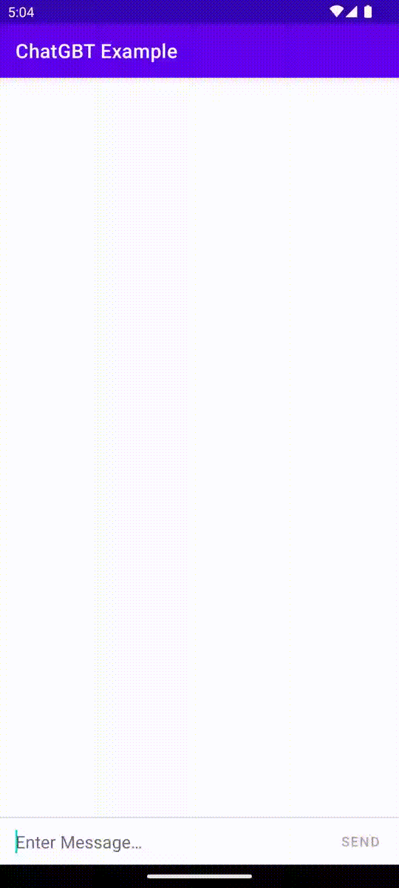

# ChatGBT Demo

This Android app shows a demo of a chat with ChatGPT.

# Technologies used in this demo:
* Kotlin
* Ktor
* Kotlinx-Serialization
* Delegates
* Typealias
* Coroutines
* Flow
* Hilt
* Coil
* View Binding
* MVVM
* Clean Architecture

# Let me know!
If you have any questions or suggestion please contact me on mobidroid92@gmail.com

# About
Find me on LinkedIn: https://www.linkedin.com/in/mobidroid92/
